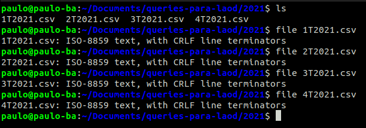
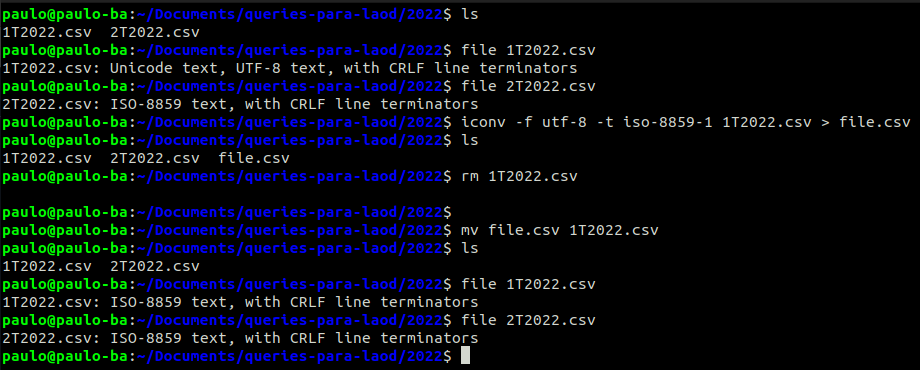
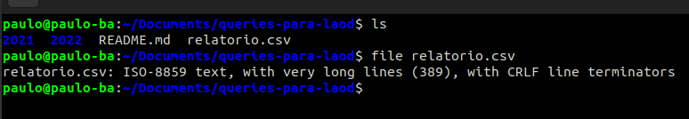

# Queries para load 

- 1° Baixei os arquivos dos últimos 2 anos no repositório público: http://ftp.dadosabertos.ans.gov.br/FTP/PDA/demonstracoes_contabeis/

- 1. Deixei todos os arquivos de 2021 no mesmo encoding (ISO-8859)

- 2. Deixando todos os arquivos de 2022 no mesmo encoding

- 2° Baixei o csv que estava em anexo no e-mail, no meu repositório está nomeado como: relatorio.csv. Esse arquivo estava com encoding correto.

- 3° Criei queries para criar tabelas com as colunas necessárias para os arquivos csv.
- 4° Criei queries de load para carregar o conteúdo dos arquivos obtidos nas tarefas de preparação.
